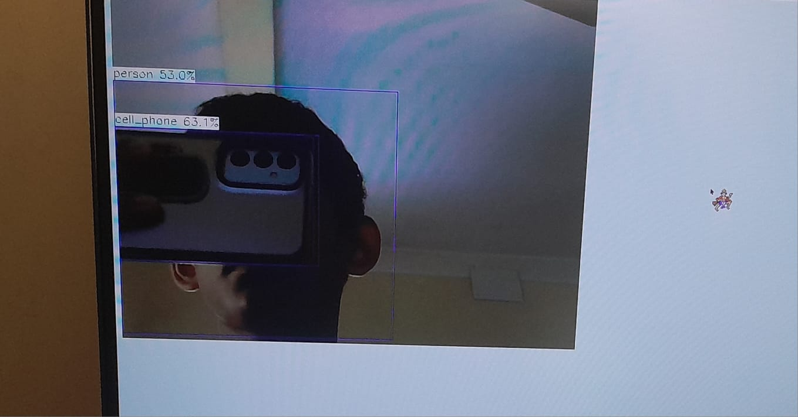
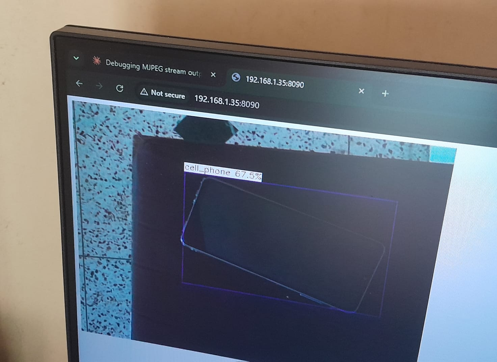
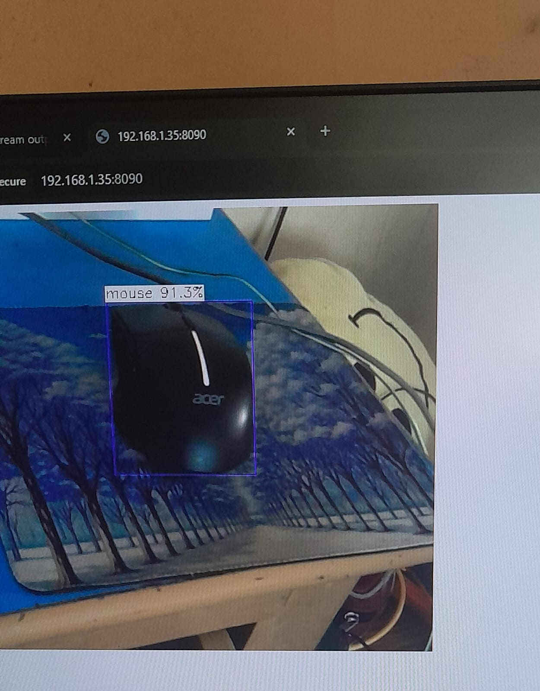

# a733-npu-yolov5-mjpeg

Real-time **YOLOv5 object detection on the Allwinner A733 NPU** (Radxa Cubie A7Z, VIPLite/awnn) with a live **MJPEG** stream you can open in any browser.

The stock Radxa/Allwinner `awnpu_model_zoo` YOLOv5 demo is single-image (`dog.jpg` in, PNG out). This repo adds the streaming layer: a webcam loop feeds the NPU, boxes are drawn on each frame, and the annotated frames are pushed to a small Flask server over a Unix socket and served over HTTP.

## Examples

Photos of the live stream open in a browser at `192.168.1.35:8090` (the board's LAN address). The overlay label is `class_name confidence%`.

| | Detection | What it shows |
|---|---|---|
|  | `person` 53.0%, `cell_phone` 63.1% | Multiple classes in one frame. The phone's back (triple camera) is held up in front of the camera, with the person behind it. |
|  | `cell_phone` 67.5% | A dark phone lying at an angle on a speckled surface. Boxes are axis-aligned, so a rotated object gets a looser box. |
|  | `mouse` 91.3% | An Acer mouse on a mouse pad: a clean, high-confidence detection. |

The browser's "Not secure" warning in the screenshots is expected: the stream is plain HTTP on the LAN (see [Known issues](#known-issues--todo)).

## How it works

```
/dev/video0 -> [yolov5_demo_a733: capture -> NPU -> draw -> imencode] --SOCK_SEQPACKET--> [stream_server.py (Flask)] --HTTP multipart--> browser
                                  non-blocking push, drops frames                          /tmp/yolo_frames.sock        :8090/stream.mjpeg
```

1. `yolov5_demo_a733` (the vendor demo, patched by this repo) captures a webcam frame, runs YOLOv5 on the NPU, and draws the boxes.
2. The annotated frame is JPEG-encoded (quality 80) and pushed by `FrameSink` (`src/stream_out.h`) to a Unix socket.
3. `server/stream_server.py` keeps only the **latest** frame and serves it to every connected browser as `multipart/x-mixed-replace`.

### Why not `popen("ffmpeg ... -listen 1")`?

Tried it first. `-listen 1` blocks on `accept()` before draining stdin, so the writer stalls (multi-second to 2 min `draw` times) once the 64 KB pipe fills, then serves exactly one client and tears the muxer down. It also produced `EOI missing` from partial frame writes. `SOCK_SEQPACKET` preserves message boundaries (no framing code needed) and `MSG_DONTWAIT` guarantees the NPU loop never blocks. If nobody is watching, or the server is slow, frames are simply dropped.

## Specs

### Hardware (tested)

| | |
|---|---|
| Board | Radxa Cubie A7Z |
| SoC | Allwinner A733: 2x Cortex-A76 (up to 2.0 GHz) + 6x Cortex-A55 (up to 1.8 GHz) |
| NPU | 3 TOPS @ INT8 (Vivante VIP9000), programmed through VIPLite/awnn |
| Camera | USB/UVC webcam at `/dev/video0` |
| Build machine | x86_64 Linux (WSL works) with the cross toolchain from the Radxa docs |

### Software

| | |
|---|---|
| Model | `yolov5s_rt_uint8_a733.nb`: YOLOv5s, uint8-quantized, compiled for the A733 NPU (from the vendor model zoo, not included) |
| Runtime | Allwinner/Radxa NPU libraries from the zoo's deploy tarball |
| Server | Python >= 3.8 (uses `:=`), Flask |
| Stream | MJPEG, JPEG quality 80, HTTP port `8090` |
| Frame transport | Unix `SOCK_SEQPACKET` at `/tmp/yolo_frames.sock` |
| Endpoints | `/` (HTML page with the stream), `/stream.mjpeg` (raw MJPEG) |

## Detected classes

The stock YOLOv5s model detects the **80 COCO classes**. Multi-word names appear with underscores in the overlay (e.g. `cell_phone`, as seen in the examples above).

| | | | | |
|---|---|---|---|---|
| person | bicycle | car | motorcycle | airplane |
| bus | train | truck | boat | traffic light |
| fire hydrant | stop sign | parking meter | bench | bird |
| cat | dog | horse | sheep | cow |
| elephant | bear | zebra | giraffe | backpack |
| umbrella | handbag | tie | suitcase | frisbee |
| skis | snowboard | sports ball | kite | baseball bat |
| baseball glove | skateboard | surfboard | tennis racket | bottle |
| wine glass | cup | fork | knife | spoon |
| bowl | banana | apple | sandwich | orange |
| broccoli | carrot | hot dog | pizza | donut |
| cake | chair | couch | potted plant | bed |
| dining table | toilet | tv | laptop | mouse |
| remote | keyboard | cell phone | microwave | oven |
| toaster | sink | refrigerator | book | clock |
| vase | scissors | teddy bear | hair drier | toothbrush |

## Repository layout

| Path | Role |
|---|---|
| `src/stream_out.h` | `FrameSink`: header-only, non-blocking JPEG push, lazy reconnect |
| `server/stream_server.py` | Socket ingest + Flask `multipart/x-mixed-replace` (`/`, `/stream.mjpeg`) |
| `patches/apply_patch.sh` | Idempotent patch for the vendor `yolov5_post.cpp` (+ optional `main.cpp` webcam patch) |
| `scripts/deploy.sh` | Build machine: `make` + `scp` binary/server/runner to the board |
| `scripts/run_board.sh` | Board: start server + binary with respawn |
| `docs/images/` | Example screenshots used in this README |

Vendor code is **not** included (see `.gitignore`). Get the model zoo from the Radxa docs.

## Install

### 1. Build machine (x86_64, cross toolchain per Radxa docs)

```bash
git clone https://github.com/testingElectroBAI/a733-npu-yolov5-mjpeg.git
cd a733-npu-yolov5-mjpeg

# patch the vendor example so it pushes frames to FrameSink
patches/apply_patch.sh <zoo>/examples/yolov5

# build per the Radxa docs (cmake/make in <zoo>/examples/yolov5/build), then build + ship to the board:
ZOO_EXAMPLE=<zoo>/examples/yolov5 BOARD=radxa@<board-ip> scripts/deploy.sh
```

`deploy.sh` runs `make`, creates `~/deploy` on the board, and copies `yolov5_demo_a733`, `stream_server.py` and `run_board.sh` into it.

### 2. Board (first time only)

```bash
sudo apt install -y python3-flask     # Python >= 3.8
```

Also put the `.nb` model and the NPU shared libraries in `~/deploy` (both come from the zoo's deploy tarball).

### 3. Webcam loop

`main.cpp`'s webcam loop (`-i webcam`) is a local modification of the vendor file. Capture it once so the repo is reproducible:

```bash
diff -u <original_extract>/examples/yolov5/main.cpp <zoo>/examples/yolov5/main.cpp > patches/main_webcam.patch
```

`apply_patch.sh` applies it automatically when the file is present.

## Run

On the board:

```bash
cd ~/deploy && ./run_board.sh
```

Then open `http://<board-ip>:8090/` in a **browser** (VLC's MJPEG demuxer is pickier). `run_board.sh` starts the server, then runs `./yolov5_demo_a733 -nb <model> -i webcam` in a loop, restarting it after 1 s if it exits.

### Configuration

| Variable | Where | Default | Purpose |
|---|---|---|---|
| `NB` | `run_board.sh` | `yolov5s_rt_uint8_a733.nb` | Model file passed to the binary |
| `PORT` | `stream_server.py` | `8090` | HTTP port |
| `YOLO_SOCK` | `stream_server.py` | `/tmp/yolo_frames.sock` | Unix socket path (must match `FrameSink`'s path) |
| `ZOO_EXAMPLE` | `deploy.sh` | *(required)* | Path to `<zoo>/examples/yolov5` |
| `BOARD` | `deploy.sh` | `radxa@192.168.1.35` | SSH target for deployment |

## Sanity test (server only, no NPU)

```bash
python3 server/stream_server.py &
python3 -c "import socket,time;s=socket.socket(1,socket.SOCK_SEQPACKET);s.connect('/tmp/yolo_frames.sock');[(s.send(open('dog.jpg','rb').read()),time.sleep(.04)) for _ in range(500)]"
```

Then open `http://localhost:8090/`. You should see the JPEG repeated at about 25 fps.

## Troubleshooting

| Symptom | Likely cause / fix |
|---|---|
| Page loads but the image is blank | Server is up but the NPU binary isn't pushing frames yet. Check that `run_board.sh` is running and the model/libs are in `~/deploy`. |
| Nothing at `:8090` | Server not running, or a firewall blocks the port. Confirm with `curl -I http://<board-ip>:8090/`. |
| Stream works in a browser but not in VLC | Use a browser; VLC's MJPEG demuxer is stricter. |
| `SyntaxError` starting the server | Python older than 3.8 (the server uses `:=`). |
| `patch did not apply cleanly` | The vendor `yolov5_post.cpp` differs from the version this patch expects. Compare it against the `imwrite("output_yolov5.png", ...)` line the script looks for. |

## Known issues / TODO

- `main.cpp` writes every captured frame to disk (`imwrite(capture_path, ...)`) before inference. Move to `/dev/shm` or pass the `cv::Mat` directly. This is likely the FPS ceiling.
- Still-image mode no longer writes `output_yolov5.png` (replaced by the push).
- Single ingest connection: one producer at a time.
- The server reads each frame with a 1 MiB receive buffer, so JPEGs larger than that would be truncated. Fine at the default quality of 80, but keep it in mind if you raise the resolution or quality.
- No auth and no TLS on the HTTP stream. LAN only.

## Credits

NPU runtime, model zoo, and `yolov5s_rt_uint8_a733.nb` are Allwinner/Radxa's. This repo covers only the streaming glue (MIT, see `LICENSE`).
